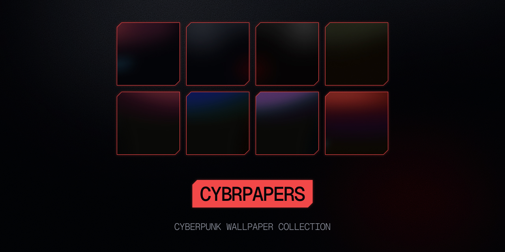

> Collection of hand-crafted wallpapers in a visual style inspired by the UI design language and color palette popularized by **Cyberpunk 2077**.  
> Mimicking the way ambient light reflects on screen surfaces.

Current sizes: **2560×1440** (QHD) only

---

## To-do
- [ ] Support for more devices
  - Desktop
    - 1920×1080   (FHD)
    - 3840×2160   (4K)
    - 7680×4320   (8K)
  - MacBook
    - 2560×1600   (13” Air M1, M2, M3; Pro M1, M2)
    - 3024×1964   (14” M1 Pro/Max, M2 Pro/Max, M3 Pro/Max)
    - 2880×1864   (15” Air M2, M3)
    - 3456×2234   (16” M1 Pro/Max, M2 Pro/Max, M3 Pro/Max)
  - iMac
    - 4480×2520   (24”)
    - 5120×2880   (27”)
  - iPhone
    - 640×1136    (SE 2016)
    - 750×1334    (6, 6s, 7, 8, SE 2020)
    - 1080×1920   (6 Plus, 7 Plus, 8 Plus)
    - 828×1792    (XR, 11)
    - 1125×2436   (X, XS, 11 Pro, 12 Mini)
    - 1242×2688   (XS Max, iPhone 11 Pro Max)
    - 1170×2532   (12, 12 Pro, 13, 13 Pro, 14)
    - 1080×2340   (13 Mini)
    - 1284×2778   (12 Pro Max, 13 Pro Max, 14 Plus)
    - 1179×2556   (14 Pro, 15, 15 Pro)
    - 1290×2796   (14 Pro Max, 15 Plus, 15 Pro Max)
  - Android
    - 1440×2560   (Nexus 6P, Google Pixel XL, 2 XL, Samsung Galaxy Note 5, LG G5)
    - 1440×2960   (Pixel 3 XL, Galaxy S7 Edge, Note 9, S8, S8+, S9, S9+)
    - 1080×1920   (Nexus 5X, Pixel, One Plus 3)
    - 1080×2280   (Google Pixel 4, Galaxy Note 10)
    - 1440×869    (Pixel 4 XL)
    - 1080×2160   (Pixel 3, 3a XL)
    - 1080×2220   (Pixel 3a)
    - 1440×3040   (Galaxy Note 10+)
    - 1080×2340   (Galaxy S23, S23+, S23 Ultra)
    - 1080×2400   (Pixel 8, Asus ROG Phone 8 Pro)
    - 1440×3200   (One Plus 12, Xiaomi 14 Pro)
    - 1344×2992   (Pixel 8 Pro)
- [ ] Create more wallpapers

---

## Disclaimer

This project is an independent, fan-inspired art collection.  
It is **not affiliated with, endorsed by, or sponsored by CD PROJEKT RED** or *Cyberpunk 2077*.

All images in this repository are original works created by **Kevin Scherrer**, released under the  
**[CC0 1.0 Universal (Public Domain)](https://creativecommons.org/publicdomain/zero/1.0/)** license.

Use, remix, and share freely. Attribution is appreciated but not required.